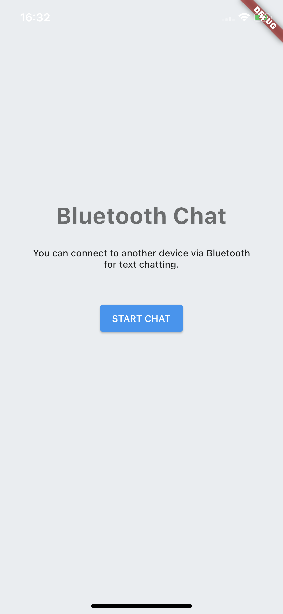
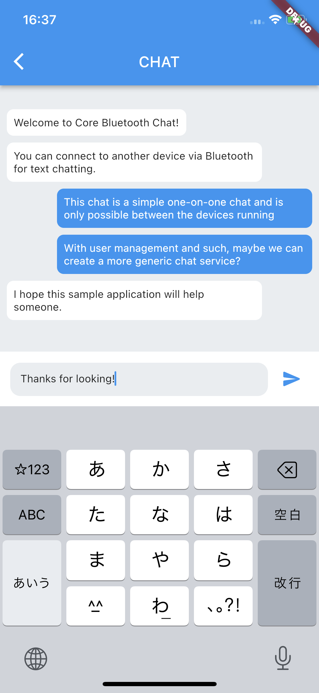

# Core Bluetooth Sample app

Here is a sample project for a one-to-one chat application using [CoreBluetooth](https://developer.apple.com/documentation/corebluetooth) for iOS.  
After connecting via Bluetooth, chat messages are sent and received in Stream using L2CAP.  

The Bluetooth connection is implemented in Swift, and the UI part is implemented in [Flutter](https://docs.flutter.dev).  
Flutter installation is required to run this app.  
Two other actual iOS devices are required; Simulator cannot be used because Bluetooth cannot be enabled.  

|Start|Chat|
|---|---|
|||

## LISENCE
MIT